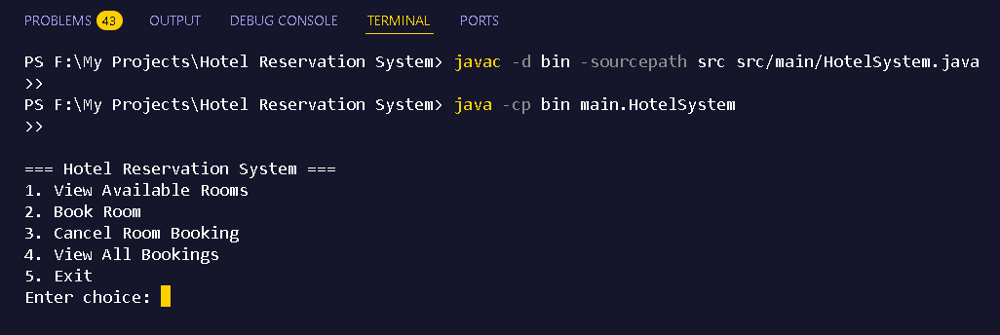
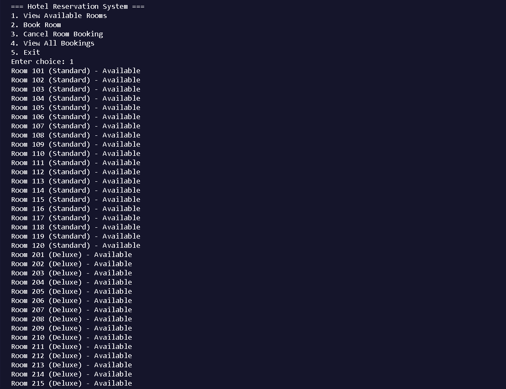
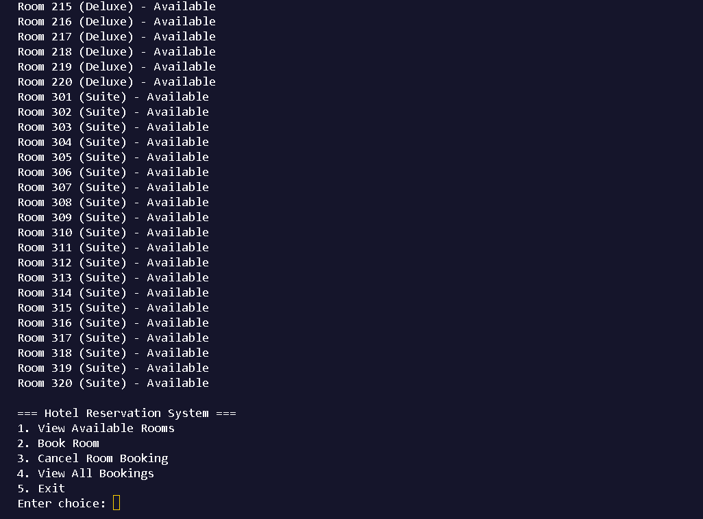
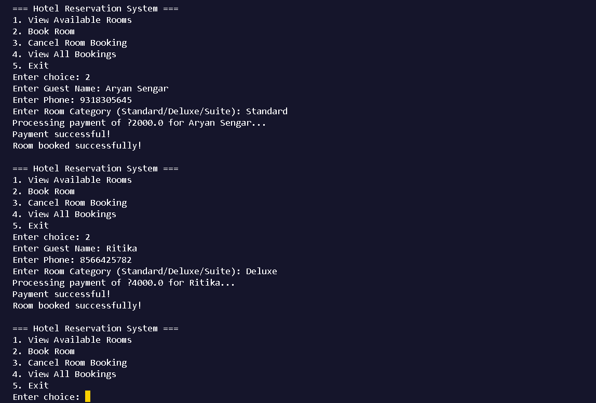
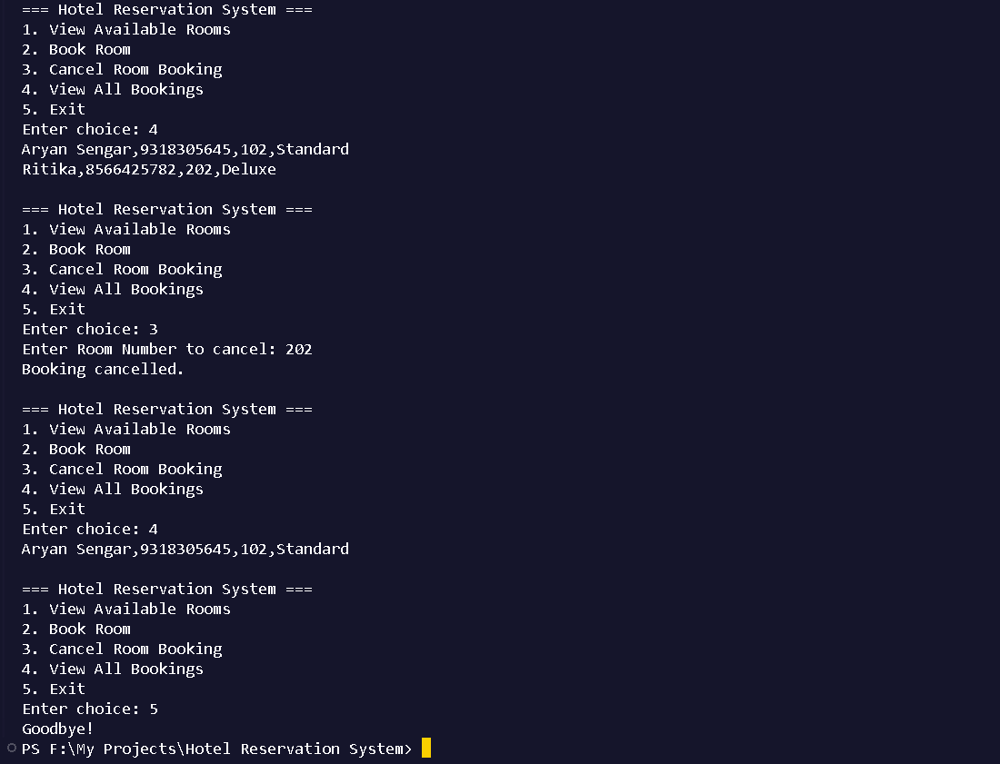

# Hotel Reservation System (Java CLI Project)

A simple command-line Hotel Reservation System built using Java as part of my internship project. The system allows users to search, book, and manage hotel room reservations categorized as Standard, Deluxe, or Suite. It features payment simulation and booking history, with all data stored using text-based file I/O.

---

## ✅ Features

- 🏨 **Room Categorization** — Standard, Deluxe, Suite
- 🔍 **Search Available Rooms**
- 📝 **Book a Room** with guest name and phone
- ❌ **Cancel Room Booking** by room number
- 💳 **Simulated Payment** processing
- 📋 **View Booking History**
- 📁 **Data Persistence** using `rooms.txt` and `bookings.txt`
- ☕ Built entirely using **Core Java** and **OOP principles**

---

## 📂 Project Structure

```
Hotel-Reservation-System-Java/
├── src/
│   └── main/
│       ├── HotelSystem.java              
│       ├── model/
│       │   ├── Room.java
│       │   ├── Booking.java
│       │   └── Guest.java
│       └── util/
│           ├── DataManager.java
│           └── PaymentSimulator.java
├── data/
│   ├── rooms.txt                         
│   └── bookings.txt                      
```

---

## 🛠 How to Compile and Run

### 📌 Compile
```bash
javac -d bin -sourcepath src src/main/HotelSystem.java
```

### ▶️ Run
```bash
java -cp bin main.HotelSystem
```

> Make sure the `data/` folder exists with:
> - `rooms.txt` → contains room information  
> - `bookings.txt` → can be empty initially

---

## 🧪 Sample Data

#### 📄 `rooms.txt`
```
101,Standard,false
102,Standard,false
...
301,Suite,false
302,Suite,false
```

#### 📄 `bookings.txt`
```
Aryan Sengar,9318305645,201,Deluxe
```

---

## 📸 Demo

[](assets/result_1.png)
[](assets/result_2.png)
[](assets/result_3.png)
[](assets/result_4.png)
[](assets/result_5.png)

---

## 📚 Technologies Used

- Java 8+
- OOP (Object-Oriented Programming)
- File I/O
- CLI-based (no external libraries)

---

## 📄 License

This project is created for educational and internship purposes.

---

## 🙋‍♂️ Author

**Aryan Sengar**  
📍 Gurgaon, India  
🛠 B.Tech CSE with specialization in AI & ML  
🔗 [LinkedIn](https://www.linkedin.com/in/aryan-sengar-786b96290/)
